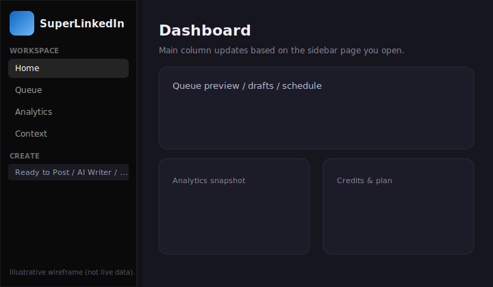
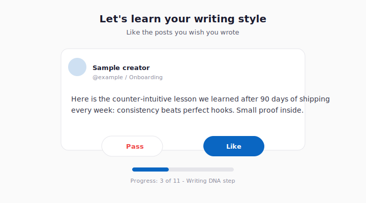
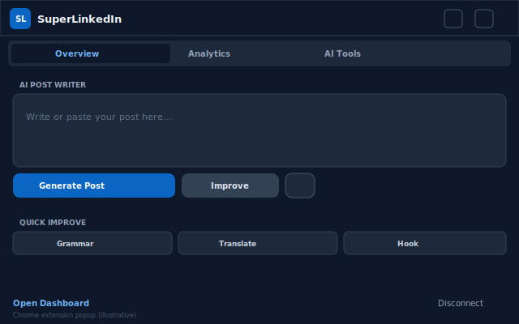
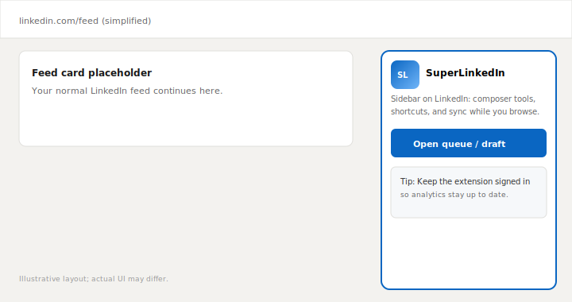

# Welcome to SuperLinkedIn

SuperLinkedIn is an **AI copilot built for LinkedIn**. It helps you **draft posts in a voice that sounds like you**, **stay consistent** with queues and scheduling, and **understand how your content performs**—especially when you use our Chrome extension alongside LinkedIn.

SuperLinkedIn is an independent product and **is not affiliated with LinkedIn**.



*Figure: Web dashboard — sidebar (Home, Queue, Analytics, Context, Create, …) and main column.*

---

## PDF version (with figures)

This guide is also available as a printable PDF that includes all illustrations:

- **Public link (production):** [https://www.superlinkedin.org/guide/SuperLinkedIn-User-Guide.pdf](https://www.superlinkedin.org/guide/SuperLinkedIn-User-Guide.pdf) — works once the PDF is deployed with the site.
- **In-repo path:** [`guide/SuperLinkedIn-User-Guide.pdf`](guide/SuperLinkedIn-User-Guide.pdf)
- **Source layout:** [`guide/user-guide.html`](guide/user-guide.html) (same text + embedded figures)

**Build the PDF locally** (requires Node.js):

```bash
cd superlinkedin.org
npm install
npm run guide:pdf
```

Uses **Google Chrome** or **Microsoft Edge** already on your machine (via Playwright). If neither works, install Chromium once:

```bash
npx playwright install chromium
```

Then set `PLAYWRIGHT_CHROMIUM_EXECUTABLE_PATH` to that Chromium binary. Alternatively install the full Playwright package (`npm install -D playwright`), run `npx playwright install chromium`, and point the env var at the downloaded browser.

Illustrations are SVG wireframes in [`guide/images/`](guide/images/) (not live screenshots).

---



*Figure: Writing DNA — Like / Pass trains style preferences.*

---



*Figure: Extension toolbar popup — Overview, Analytics, AI Tools.*

---



*Figure: SuperLinkedIn sidebar while browsing LinkedIn.*

---

## Why connect your LinkedIn account?

When you sign up, you **sign in with LinkedIn** using LinkedIn’s official login screen (OAuth). That lets SuperLinkedIn:

- Know **who you are** so your workspace and queue stay private to your account  
- **Publish or prepare posts** on your behalf when you choose to (according to the permissions LinkedIn shows at login)  
- Work smoothly with the **Chrome extension**, which operates while you browse LinkedIn  

You never give SuperLinkedIn your LinkedIn password directly—you authenticate with LinkedIn, then LinkedIn sends SuperLinkedIn a secure token for the actions you approve.

---

## What onboarding is for (your voice & context)

Onboarding isn’t busywork—it teaches SuperLinkedIn **how you like to sound** and **what you’re building toward**, so AI drafts feel closer to something you’d actually post.

### 1. Writing DNA — “posts you wish you wrote”

You’ll see a short stack of sample posts. For each one you choose **Like** or **Pass**.  

SuperLinkedIn uses those choices to infer **tone and style you respond to**—structure, hooks, pacing—not to copy anyone’s identity. That becomes part of how the AI writes **with your taste in mind**.

### 2. About you

You write a brief description of **who you are, what you talk about, and who you’re trying to reach**.  

That context reduces generic drafts and keeps suggestions aligned with **your niche and goals**.

### 3. Favorite creators (optional)

You can pick **up to three creators** whose writing you admire.  

SuperLinkedIn can study patterns in **how they write** (not their topics wholesale) to help your drafts echo **voices you already like**, while your themes stay yours. You can skip this if you prefer.

### 4. Chrome extension (recommended)

You’ll be encouraged to install the **SuperLinkedIn Chrome extension**.  

It adds tools **inside LinkedIn**—insights, AI shortcuts, and syncing so analytics can reflect what’s happening on your account. You can skip and install later; the web dashboard still works.

### 5. Products you promote (optional)

If you sell something or promote links, you can add **up to five product URLs**.  

SuperLinkedIn can **learn what those pages are about** so when you ask for posts or ideas, CTAs and angles fit **what you actually offer**. Skip if you’re not promoting anything yet.

When you finish, you land on your **dashboard**, ready to queue posts, open the AI writer, and explore analytics.

---

## After onboarding — what you’ll use most

These names match what you’ll see in the app sidebar:

| Area | What it’s for |
|------|----------------|
| **Home** | Overview and gentle nudges to finish setup |
| **Queue** | Line up posts and manage what goes out when |
| **Analytics** | See performance trends (extension helps keep data fresh) |
| **Context** | Edit the profile rules and interests that steer your AI—the living version of “about you” + voice hints |
| **Create** | Ready-to-post workflow, viral templates (where your plan allows), AI Writer, carousels, and image tools |
| **Engage** | Discover people and posts, handle mentions/replies, optional automation on higher plans |
| **CRM** | **DMs** and **Bulk DMs** for structured outreach |
| **Settings** | Account, subscription, team (if applicable), theme, API keys |

**Credits:** Features that call the AI draw from your **credit balance**. Your plan decides how many you get and how often they refresh—check **Settings** if you’re unsure.

---

## Tips for results that sound like you

1. **Spend real time on Writing DNA** — more consistent likes/passes yield clearer style signals.  
2. **Keep Context updated** when your role or niche shifts.  
3. **Use the extension on LinkedIn** if you want richer analytics and faster workflows while you browse.

---

## Need help?

Use **Settings** in the dashboard for billing and account controls. For product questions, use whichever support channel SuperLinkedIn publishes on its website.
